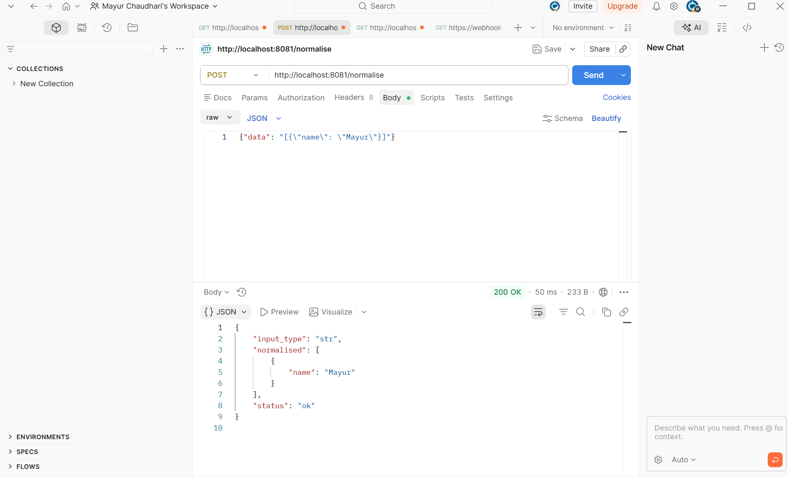
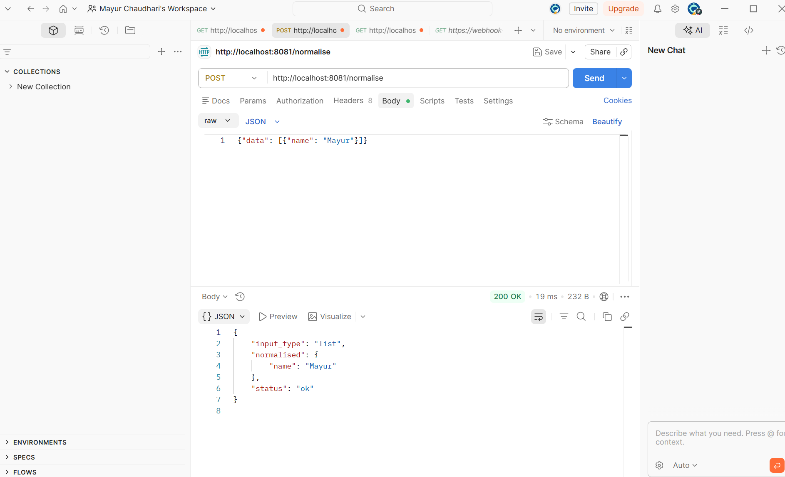
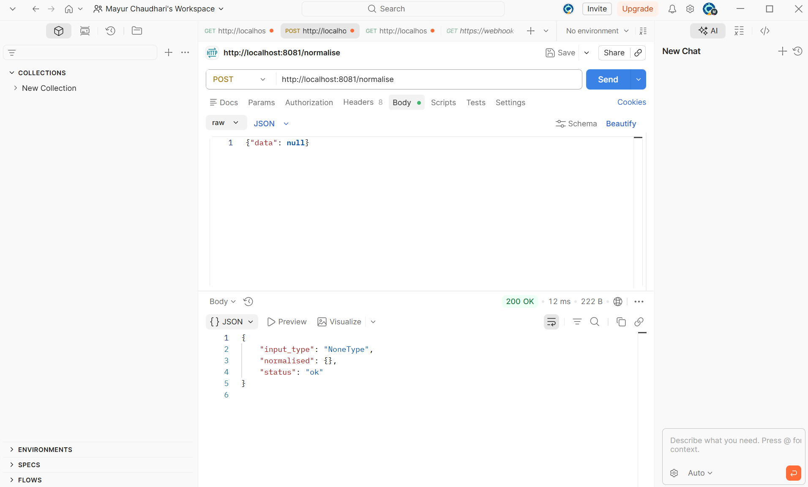
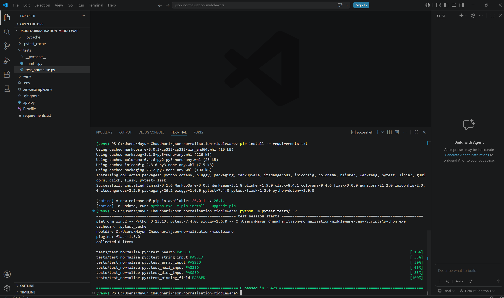
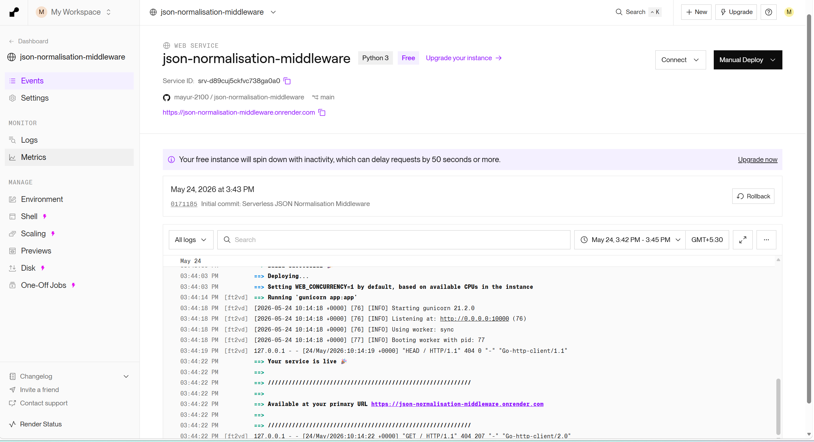

# JSON Normalisation Middleware

A Python serverless middleware service that resolves inconsistent upstream
API responses — where input types vary between string, array, null, and
object — and returns a guaranteed, consistently typed JSON payload to
downstream systems.

## The Problem It Solves

Third-party APIs often return inconsistent response structures depending
on context. A field might be a JSON string in one response, an array in
another, and null in a third. This breaks downstream automation modules
that expect a fixed schema.

This middleware sits between the upstream API and your downstream system,
detecting the incoming type and normalising it every time.

## Live Demo

- **API:** https://YOUR-RENDER-URL.onrender.com
- **Health:** https://YOUR-RENDER-URL.onrender.com/health

> Note: Free tier cold start may take 30 seconds on first request.

## How It Works

```
Upstream API (inconsistent response)
            ↓
   POST /normalise
            ↓
   Schema variant detected
   (string / array / null / object)
            ↓
   Normalised to consistent typed payload
            ↓
   Clean JSON returned to downstream system
```

## API Reference

### GET /health
```json
{ "status": "ok", "service": "json-normalisation-middleware" }
```

### POST /normalise

Accepts a payload with a `data` field of any type and returns a
normalised object.

**Request:**
```json
{ "data": "<any type>" }
```

**Behaviour by input type:**

| Input Type | Example Input | Normalised Output |
|---|---|---|
| String (JSON) | `"[{\"name\": \"Mayur\"}]"` | `{"name": "Mayur"}` |
| Array | `[{"name": "Mayur"}, {...}]` | `{"name": "Mayur"}` |
| Null | `null` | `{}` |
| Object | `{"name": "Mayur"}` | `{"name": "Mayur"}` |

**Response:**
```json
{
  "status": "ok",
  "input_type": "str",
  "normalised": { "name": "Mayur" }
}
```

**Validation errors:**

Missing `data` field → `422`
```json
{ "error": "Missing required field: data" }
```

Invalid JSON body → `400`
```json
{ "error": "Invalid or missing JSON body" }
```

## Screenshots

### String input normalised


### Array input normalised


### Null input normalised


### Tests passing


### Render deployment


## Local Setup

```bash
git clone https://github.com/mayur-2100/json-normalisation-middleware
cd json-normalisation-middleware
python -m venv venv && source venv/bin/activate  # Windows: venv\Scripts\activate
pip install -r requirements.txt
cp .env.example .env
python app.py
```

## Running Tests

```bash
pytest tests/ -v
```

Expected output:
```
PASSED tests/test_normalise.py::test_health
PASSED tests/test_normalise.py::test_string_input
PASSED tests/test_normalise.py::test_array_input
PASSED tests/test_normalise.py::test_null_input
PASSED tests/test_normalise.py::test_dict_input
PASSED tests/test_normalise.py::test_missing_field
```

## Deployment

Deployed on Render as a Python web service using Gunicorn.
No database required — stateless request processing.

## Tech Stack

- Python 3.10+
- Flask
- Gunicorn
- Render (deployment)
- pytest
